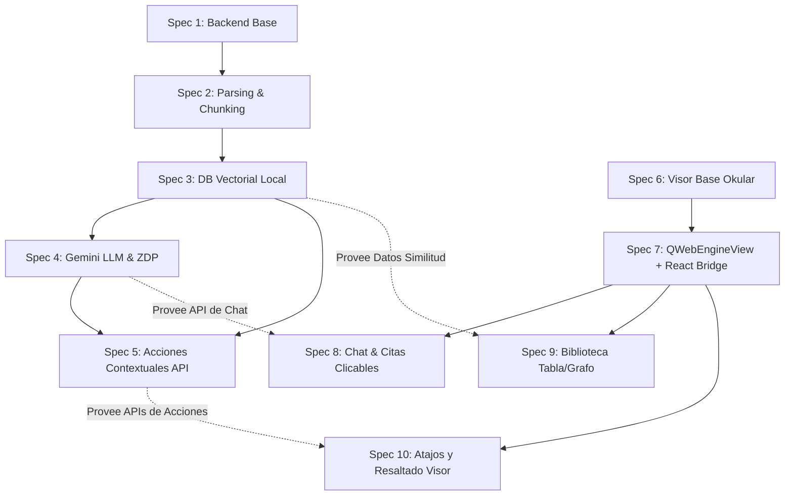

# Planificación y Etapas de Desarrollo (Specs)

Este documento detalla la planificación general del proyecto, la secuencia lógica de implementación, la viabilidad de paralelización y el estado actual de cada especificación (Spec) según la metodología **Spec Driven Development (SDD)**.

---

## 1. Resumen de la Planificación por Etapas

Para optimizar el desarrollo, el proyecto se divide en tres etapas lógicas, habilitando la paralelización una vez construidos los cimientos del sistema.

### Etapa 1: Infraestructura de Datos (Serie Estricta)
* **Specs involucradas:** Spec 1, Spec 2, Spec 3.
* **Descripción:** Configuración inicial del servidor FastAPI, desarrollo de la ingesta de PDFs, el chunking semántico y la base de datos vectorial local (LanceDB/SQLite-vec).
* **Paralelización:** **No es posible**. Cada spec requiere el resultado de la anterior para poder construirse.

### Etapa 2: Inteligencia e Integración de Interfaz (Paralelización Máxima)
* **Specs involucradas:**
  * *Línea Backend (IA):* Spec 4, Spec 5.
  * *Línea Frontend/Visor (C++/Qt):* Spec 6, Spec 7.
* **Descripción:** Mientras un equipo configura el fork de Okular y embebe la aplicación React mediante `QWebEngineView` (Spec 6 y 7), otro equipo puede implementar los endpoints de la API de Gemini, la lógica pedagógica ZDP y las acciones contextuales (Spec 4 y 5).
* **Paralelización:** **Alta**. Ambas líneas de trabajo son independientes entre sí y se pueden desarrollar de manera simultánea.

### Etapa 3: Consolidación e Interactividad (Paralelización Parcial)
* **Specs involucradas:** Spec 8, Spec 9, Spec 10.
* **Descripción:** Conexión final de los componentes UI de React con el backend de FastAPI e integración con la API de Okular.
* **Paralelización:** **Media**. El Chat (Spec 8) y la Biblioteca (Spec 9) se pueden desarrollar de forma paralela. La Spec 10 (Atajos del visor C++) se ejecutará al final como consolidación.

---

## 2. Tabla de Estado de las Specs

Esta tabla registra el estado actual de cada especificación según el ciclo de vida de la metodología SDD.

| ID | Título | Definida | Planeada | Plan de Des. | Implementada | Aprobada |
| :--- | :--- | :---: | :---: | :---: | :---: | :---: |
| **Spec 1** | Backend Base | ✔️ Sí | ✔️ Sí | ✔️ Sí | ✔️ Sí | ✔️ Sí |
| **Spec 2** | Parsing & Chunking | ✔️ Sí | ✔️ Sí | ✔️ Sí | ✔️ Sí | ✔️ Sí |
| **Spec 3** | Base de Datos Vectorial | ✔️ Sí | ✔️ Sí | ✔️ Sí | ✔️ Sí | ✔️ Sí |
| **Spec 4** | Integración LLM & ZDP | ✔️ Sí | ✔️ Sí | ✔️ Sí | ✔️ Sí | ✔️ Sí |
| **Spec 5** | Servicios de Acción Contextual | ✔️ Sí | ✔️ Sí | ✔️ Sí | ✔️ Sí | ✔️ Sí |
| **Spec 6** | Visor Base Okular | ✔️ Sí | ✔️ Sí | ✔️ Sí | ✔️ Sí | ✔️ Sí |
| **Spec 7** | Entorno de Integración Web | ✔️ Sí | ✔️ Sí | ✔️ Sí | ✔️ Sí | ❌ No |
| **Spec 8** | Interfaz de Chat y Referencias | ❌ No | ❌ No | ❌ No | ❌ No | ❌ No |
| **Spec 9** | Biblioteca: Tabla y Grafo | ❌ No | ❌ No | ❌ No | ❌ No | ❌ No |
| **Spec 10**| Atajos de Selección del Visor | ❌ No | ❌ No | ❌ No | ❌ No | ❌ No |

---

## 3. Gráfico de Dependencias Causales

Las flechas representan dependencias lógicas estricta (**A --> B** significa que **A debe estar implementada antes de que B pueda iniciar**). Las líneas punteadas representan dependencias de servicios o API necesarias para la etapa final.

