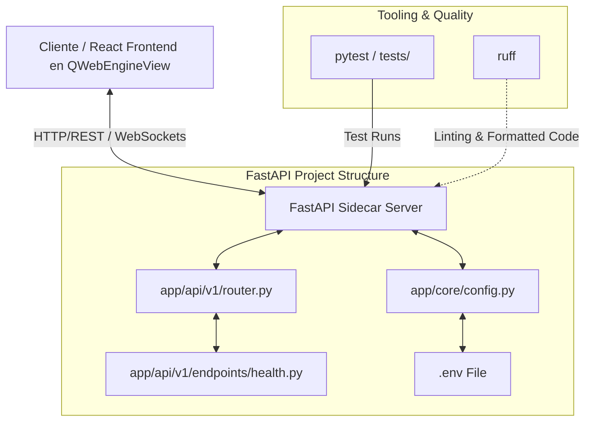

# Especificación de Requisitos (Spec): Spec 1 - Backend Base

Este documento establece la definición formal de la **Spec 1: Backend Base** según la metodología Spec Driven Development (SDD). Esta especificación define el alcance, límites, arquitectura y flujos para establecer la infraestructura base del backend local en FastAPI.

---

## 1. Definición del Problema y Objetivos
El proyecto requiere un backend local que actúe como un "sidecar" para el lector de PDF nativo y su interfaz React. Este backend proveerá servicios de extracción de texto, base de datos vectorial y comunicación con la API de Gemini. 

El objetivo de esta Spec es establecer una base limpia, estandarizada y robusta que permita desarrollar las siguientes etapas sin fricciones de configuración de entorno, dependencias o arquitectura.

---

## 2. Alcance (Límites del Sistema)

### Qué HACE la Spec (In-Scope)
* **Gestión de Entorno y Dependencias:** Configuración del entorno virtual utilizando `uv` con un archivo `pyproject.toml` para Python 3.11.
* **Estructura Modular del Proyecto:** Creación del andamiaje básico de directorios para FastAPI (API, Routers, Core, Services, Models).
* **Configuración Tipada:** Carga de variables de entorno usando `pydantic-settings` a partir de un archivo `.env` (incluyendo `GEMINI_API_KEY`, `VECTOR_DB_PATH`, `LOG_LEVEL`).
* **Middlewares Críticos:** Habilitación de CORS (Cross-Origin Resource Sharing) para permitir que la interfaz React embebida en Okular se comunique sin problemas de origen con la API local.
* **Endpoints de Infraestructura:** Endpoint de salud (`/health`) para validación de estado por parte de la UI o Okular.
* **Calidad de Código:** Configuración de `ruff` como linter y formateador oficial.
* **Base de Pruebas:** Configuración inicial de `pytest` y `httpx` con una prueba de integración básica para el endpoint `/health`.

### Qué NO HACE la Spec (Out-of-Scope)
* **No implementa parsing de PDFs:** La lógica para extraer texto de PDFs se diseñará y codificará en la **Spec 2**.
* **No conecta la base de datos:** El almacenamiento vectorial (LanceDB/SQLite-vec) y su lógica de persistencia se desarrollarán en la **Spec 3**.
* **No realiza llamadas a la IA:** La integración con la API de Google Gemini y la lógica pedagógica (ZDP) pertenecen a la **Spec 4**.
* **No interactúa con el visor o el frontend:** Toda la lógica de la UI React y la integración nativa C++ en Okular pertenecen a las specs de la Etapa 2 y 3.

---

## 3. Arquitectura y Flujo de Datos

### Diagrama de la Arquitectura Base

### Flujo de Datos: Endpoint de Salud
1. El cliente (React/Okular) envía una petición `GET http://localhost:8000/health`.
2. FastAPI intercepta la petición a través de los middlewares (incluyendo CORS).
3. El enrutador (`app/api/v1/router.py`) delega la petición a `health.py`.
4. El endpoint responde con un JSON `{ "status": "ok", "version": "0.1.0" }`.

---

## 4. Próxima Fase (Fase 2: Planificación Técnica)
Una vez aprobada esta especificación de viva voz por el usuario:
1. Se realizará un **commit en git** con la definición aprobada.
2. Se iniciará la redacción del **Plan Técnico** (archivos exactos a crear y modificar, dependencias exactas y plan de ejecución).
