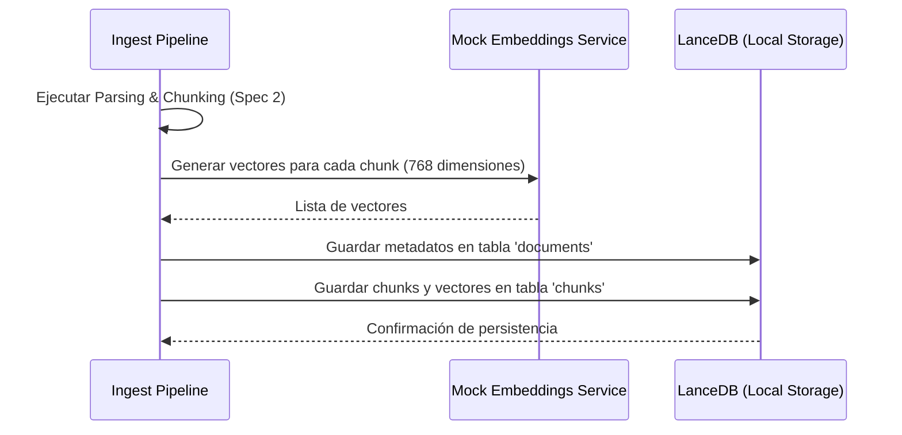
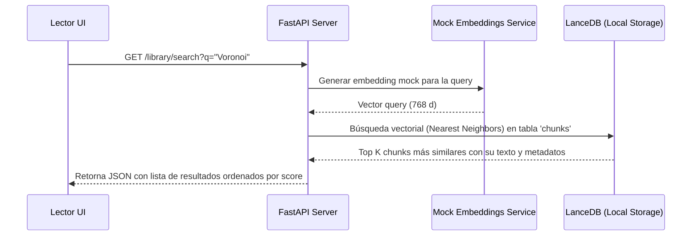

# Especificación de Requisitos (Spec): Spec 3 - Base de Datos Vectorial Local

Este documento establece la definición formal de la **Spec 3: Base de Datos Vectorial Local** según la metodología Spec Driven Development (SDD). Esta especificación define el alcance, límites, arquitectura y flujos para el almacenamiento persistente local y el motor de búsqueda semántica.

---

## 1. Definición del Problema y Objetivos
El backend actual procesa PDFs de forma asíncrona y extrae fragmentos de texto (chunks), pero los almacena temporalmente en memoria (`IN_MEMORY_DB`). Al reiniciar el servidor, la información se pierde.

El objetivo de esta Spec es integrar una base de datos vectorial embebida local (ej. **LanceDB**) para almacenar de manera permanente la biblioteca de documentos del usuario y sus fragmentos de texto con sus respectivos embeddings vectoriales. Esto permitirá realizar búsquedas semánticas rápidas (el núcleo del sistema RAG) y gestionar el catálogo de documentos.

---

## 2. Alcance (Límites del Sistema)

### Qué HACE la Spec (In-Scope)
* **Persistencia Local:** Configuración y almacenamiento de datos localmente en un directorio (por defecto `backend/data/vector_db`) utilizando LanceDB.
* **Modelos de Datos:**
  * Tabla `documents`: Guarda metadatos globales (título, páginas, fecha de adición, progreso de lectura).
  * Tabla `chunks`: Guarda el texto del fragmento, su rango de páginas físicas (`pages`), coordenadas de caracteres, nombre de sección y su vector numérico (embedding).
* **Generador de Embeddings Mock:** Creación de una interfaz de servicio para generación de embeddings que devuelva vectores de 768 dimensiones (dimensiones de Gemini `text-embedding-004`) con números aleatorios. Esto permite probar el indexado y la búsqueda semántica sin costo ni conexión externa.
* **Integración del Ingest Pipeline:** Modificación del flujo de la **Spec 2** para que, tras segmentar el PDF, genere los embeddings mock para cada chunk y guarde tanto el documento como sus chunks en las tablas correspondientes de LanceDB.
* **Endpoints de Biblioteca y Búsqueda Semántica:**
  * `GET /api/v1/library/documents`: Listar documentos.
  * `DELETE /api/v1/library/documents/{document_id}`: Borrar documento y sus chunks asociados.
  * `GET /api/v1/library/search`: Buscar semánticamente por texto (generando el embedding mock de la consulta y haciendo búsqueda de similitud de coseno en LanceDB).

### Qué NO HACE la Spec (Out-of-Scope)
* **No realiza llamadas reales a APIs de IA:** La conexión con Google Gemini para embeddings reales (`text-embedding-004`) y generación conversacional (`gemini-1.5-flash`) corresponde a la **Spec 4**.
* **No implementa el grafo interactivo:** La renderización visual de la biblioteca y del grafo pertenece a las specs del frontend en las Etapas 2 y 3.

---

## 3. Arquitectura y Flujo de Datos

### Flujo de Datos: Ingesta con Persistencia

### Flujo de Datos: Búsqueda Semántica

---

## 4. Próxima Fase (Fase 2: Planificación Técnica)
Una vez completado el formulario de requisitos por parte del usuario:
1. Realizaremos la sesión de refinamiento de la Spec 3.
2. Se creará la rama de desarrollo `backend/database-vectorial`.
3. Se redactará el Plan Técnico detallado.
