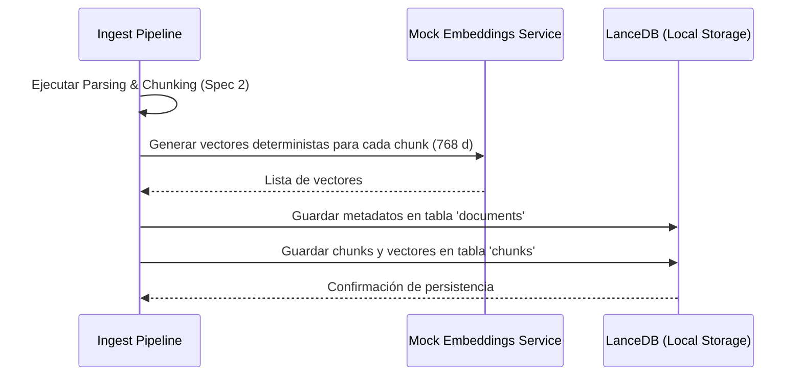
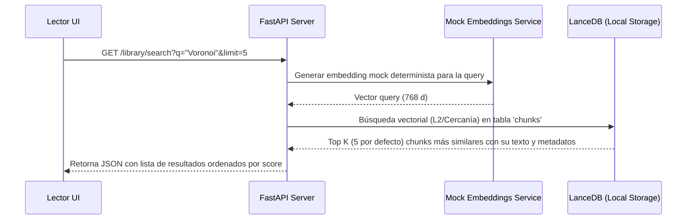

# Especificación de Requisitos (Spec): Spec 3 - Base de Datos Vectorial Local

Este documento establece la definición formal de la **Spec 3: Base de Datos Vectorial Local** según la metodología Spec Driven Development (SDD). Esta especificación define el alcance, límites, arquitectura y flujos para el almacenamiento persistente local y el motor de búsqueda semántica.

---

## 1. Definición del Problema y Objetivos
El backend actual procesa PDFs de forma asíncrona y extrae fragmentos de texto (chunks), pero los almacena temporalmente en memoria (`IN_MEMORY_DB`). Al reiniciar el servidor, la información se pierde.

El objetivo de esta Spec es integrar una base de datos vectorial embebida local (**LanceDB**) para almacenar de manera permanente la biblioteca de documentos del usuario y sus fragmentos de texto con sus respectivos embeddings vectoriales. Esto permitirá realizar búsquedas semánticas rápidas (el núcleo del sistema RAG) y gestionar el catálogo de documentos.

---

## 2. Alcance (Límites del Sistema)

### Qué HACE la Spec (In-Scope)
* **Persistencia Local:** Configuración y almacenamiento de datos localmente en un directorio (por defecto `backend/data/vector_db`) utilizando LanceDB de forma unificada (sin requerir base de datos relacional externa).
* **Modelos de Datos:**
  * Tabla `documents`: Guarda metadatos globales (título, páginas, fecha de adición, progreso de lectura, y conteo de chunks).
  * Tabla `chunks`: Guarda el texto del fragmento, su rango de páginas físicas (`pages`), coordenadas de caracteres, nombre de sección y su vector numérico (embedding).
* **Generador de Embeddings Mock Determinista:** Creación de una interfaz de servicio para generación de embeddings que devuelva vectores de 768 dimensiones (dimensiones de Gemini `text-embedding-004`) de forma determinista usando el hashing del texto como semilla. Esto asegura que textos idénticos generen vectores idénticos, permitiendo pruebas de búsqueda reproducibles y exactas.
* **Integración del Ingest Pipeline:** Modificación del flujo de la **Spec 2** para que, tras segmentar el PDF, genere los embeddings mock para cada chunk y guarde tanto el documento como sus chunks en las tablas correspondientes de LanceDB.
* **Endpoints de Biblioteca y Búsqueda Semántica:**
  * `GET /api/v1/library/documents`: Listar documentos incluyendo el total de chunks asociados.
  * `DELETE /api/v1/library/documents/{document_id}`: Borrar de forma manual en cascada un documento y todos sus chunks asociados de LanceDB.
  * `GET /api/v1/library/search`: Buscar semánticamente por texto (generando el embedding mock de la consulta y haciendo búsqueda de similitud en LanceDB con un parámetro `limit` configurable, por defecto 5).

### Qué NO HACE la Spec (Out-of-Scope)
* **No realiza llamadas reales a APIs de IA:** La conexión con Google Gemini para embeddings reales (`text-embedding-004`) y generación conversacional (`gemini-1.5-flash`) corresponde a la **Spec 4**.
* **No implementa el grafo interactivo:** La renderización visual de la biblioteca y del grafo pertenece a las specs del frontend en las Etapas 2 y 3.

---

## 3. Esquemas de Base de Datos y Colecciones

### Tabla `documents`
* `document_id` (str, hash SHA-256) - Clave primaria.
* `filename` (str) - Nombre del archivo.
* `pages_count` (int) - Número de páginas.
* `total_chars` (int) - Cantidad total de caracteres.
* `added_at` (datetime) - Fecha de adición.
* `tags` (list[str]) - Etiquetas del documento.
* `reading_progress` (float) - Porcentaje de lectura (0.0 a 100.0).

### Tabla `chunks`
* `chunk_id` (str, document_id + index) - Clave primaria.
* `document_id` (str) - Clave foránea de relación lógica.
* `text` (str) - Contenido del fragmento.
* `page_number` (int) - Página de inicio (1-indexed).
* `pages` (list[int]) - Lista de páginas que abarca.
* `char_start` / `char_end` (int) - Offsets en el documento.
* `section` (str, opcional) - Nombre de la sección.
* `vector` (vector de float32, dimensión 768) - Embedding del fragmento.

---

## 4. Arquitectura y Flujo de Datos

### Flujo de Datos: Ingesta con Persistencia

### Flujo de Datos: Búsqueda Semántica

---

## 5. Próxima Fase (Fase 2: Planificación Técnica)
Una vez aprobada esta Definición por el usuario:
1. Se realizará un commit con la especificación definida.
2. Se redactará el Plan Técnico detallado (Fase 2).

