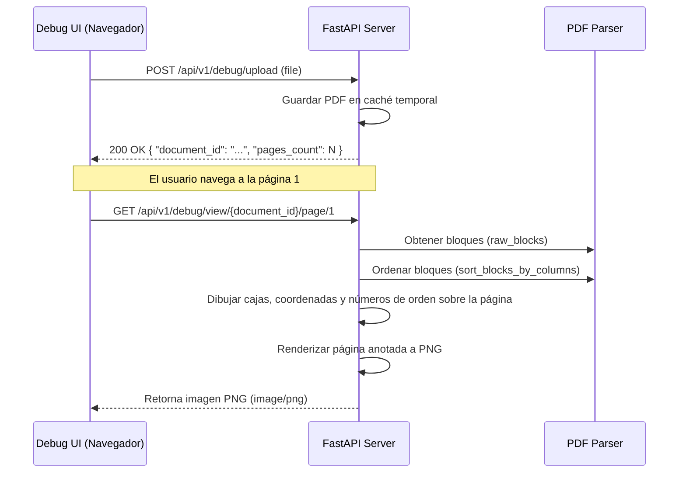

# Especificación de Requisitos (Spec): Debug PDF Parser

Este documento establece la definición formal de la herramienta de depuración **Debug PDF Parser** según la metodología Spec Driven Development (SDD). Esta especificación define el alcance, límites, arquitectura y flujos para la visualización interactiva del ordenamiento de bloques del parser de PDFs.

---

## 1. Definición del Problema y Objetivos
El motor de parsing de PDFs (`pdf_parser.py`) extrae bloques de texto y los ordena aplicando un comparador 2D de lectura topológica. Sin embargo, verificar que este algoritmo funcione correctamente sobre layouts complejos (papers con múltiples columnas, ecuaciones flotantes, tablas y gráficos) resulta difícil sin una retroalimentación visual directa de la posición y secuencia de lectura de cada bloque.

El objetivo de esta Spec es proveer una interfaz web sencilla integrada en el backend para depurar visualmente la extracción de bloques de PyMuPDF, dibujando sus cajas delimitadoras (bounding boxes), coordenadas de esquinas y su número de orden resultante.

---

## 2. Alcance (Límites del Sistema)

### Qué HACE la Spec (In-Scope)
* **Visualización de Cajas Delimitadoras:** Dibujo de rectángulos coloreados sobre cada bloque de texto obtenido de `page.get_text("blocks")`.
* **Coordenadas en Esquinas:** Inclusión de etiquetas con las coordenadas `(x0, y0)` en la esquina superior izquierda y `(x1, y1)` en la esquina inferior derecha de cada bloque.
* **Número de Ordenación Secuencial:** Dibujo de un número entero en el centro del bloque que indique su posición en la secuencia devuelta por `sort_blocks_by_columns`.
* **Interfaz Web Autónoma:** Página HTML simple servida por FastAPI (ej. `/api/v1/debug/ui`) que permita subir un PDF y navegar entre sus páginas de forma secuencial (Pág. Siguiente / Pág. Anterior).
* **Endpoints de Depuración:**
  * `POST /api/v1/debug/upload`: Subida temporal de un PDF.
  * `GET /api/v1/debug/view/{document_id}/page/{page_number}`: Retorna la imagen (PNG) de la página del PDF anotada con cajas, coordenadas y numeración de orden.

### Qué NO HACE la Spec (Out-of-Scope)
* **No altera los PDFs originales:** Las anotaciones y dibujos se hacen sobre una copia temporal en memoria o renderizada para visualización, sin modificar el archivo original del usuario.
* **No usa Okular:** La visualización es 100% web local y autocontenida.
* **No se conecta con base de datos vectorial:** Se apoya en una estructura temporal en memoria.

---

## 3. Arquitectura y Flujo de Datos

### Flujo de Trabajo de Depuración Visual

---

## 4. Próxima Fase (Fase 2: Planificación Técnica)
Una vez completado el formulario de requisitos por parte del usuario:
1. Se realizará un **commit en git** con la definición aprobada.
2. Se iniciará la redacción del **Plan Técnico** detallando las librerías de renderizado y el código de dibujo.
