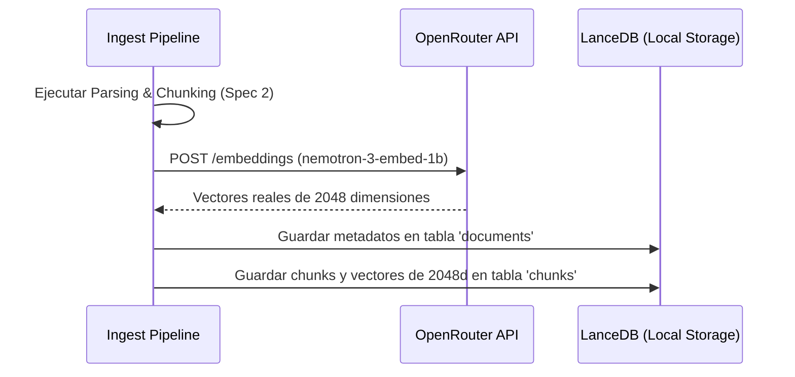
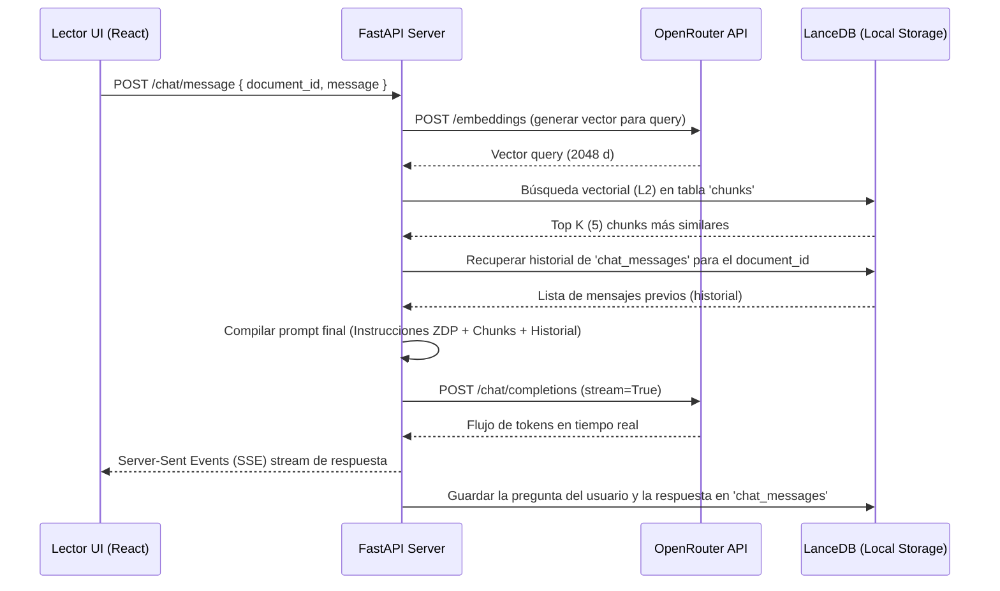

# Especificación de Requisitos (Spec): Spec 4 - Integración de LLM y Lógica ZDP

Este documento establece la definición formal de la **Spec 4: Integración de LLM y Lógica ZDP** según la metodología Spec Driven Development (SDD). Esta especificación define el alcance, límites, arquitectura y flujos para la conexión con la API de OpenRouter (con soporte para Gemini y otros modelos) y la lógica de tutoría interactiva basada en la Zona de Desarrollo Próximo (ZDP).

---

## 1. Definición del Problema y Objetivos
El backend actual puede segmentar y almacenar de forma persistente los documentos, pero utiliza embeddings mock deterministas (Spec 3). Tampoco posee un motor inteligente de lenguaje capaz de responder preguntas ni guiar al usuario en la comprensión del contenido.

El objetivo de esta Spec es:
1. Reemplazar los embeddings mock por **embeddings semánticos reales** utilizando la API de **OpenRouter** (modelo por defecto `nvidia/nemotron-3-embed-1b:free` con dimensión 2048).
2. Conectar el sistema a un modelo de lenguaje para chat conversacional (por defecto `nvidia/nemotron-3-ultra-550b-a55b:free` o similar vía OpenRouter).
3. Diseñar e inyectar prompts de sistema estructurados para aplicar la filosofía de la **Zona de Desarrollo Próximo (ZDP)**, de modo que el LLM actúe como un tutor interactivo que guíe el aprendizaje del estudiante mediante andamiaje (scaffolding).

---

## 2. Alcance (Límites del Sistema)

### Qué HACE la Spec (In-Scope)
* **Conexión con OpenRouter API:** Integración de llamadas HTTP (o SDK) a OpenRouter para la generación de embeddings y de chat completions.
* **Integración del Ingest Pipeline (Real Embeddings):** Modificación del pipeline de la Spec 2 y 3 para generar embeddings reales de 2048 dimensiones al momento de subir e indexar un PDF.
* **Motor RAG Completo:**
  * Generación de embeddings reales de 2048d para las consultas de búsqueda del usuario.
  * Recuperación del Top K (por defecto 5) chunks más relevantes desde LanceDB.
* **Lógica Pedagógica ZDP (Modo Híbrido):**
  * Inyección de instrucciones de sistema para guiar al modelo a explicar conceptos difíciles de forma sencilla, pero planteando de inmediato preguntas de validación o retos conceptuales.
  * La respuesta del LLM debe incluir una explicación fundamentada en el documento de soporte, seguida de preguntas activas de andamiaje.
* **Endpoints de Conversación y Streaming (SSE):**
  * `POST /api/v1/chat/message`: Envío de mensajes y generación de respuestas usando Server-Sent Events (SSE) para streaming palabra por palabra.
  * `GET /api/v1/chat/history/{document_id}`: Recuperación de la lista completa de mensajes de chat.
  * `DELETE /api/v1/chat/history/{document_id}`: Limpieza de la conversación asociada a un PDF.
* **Persistencia del Chat:** Almacenamiento de mensajes de chat en la base de datos LanceDB (tabla `chat_messages`).

### Qué NO HACE la Spec (Out-of-Scope)
* **No implementa la interfaz de usuario en React:** El chat lateral del lector React se desarrollará en la Spec 8.
* **No implementa los comandos de selección en el visor C++:** Las acciones contextuales rápidas corresponden a la Spec 5.

---

## 3. Esquemas de Base de Datos (LanceDB)

### Nueva Tabla `chat_messages`
* `message_id` (str, UUID) - Clave primaria.
* `document_id` (str) - ID del documento relacionado (clave foránea lógica).
* `role` (str) - Rol del emisor (`user` o `assistant`).
* `content` (str) - Texto del mensaje enviado o recibido.
* `timestamp` (datetime) - Fecha y hora del mensaje.
* `reasoning_details` (str, opcional) - Preservación de la cadena de razonamiento si el modelo la provee.

---

## 4. Arquitectura y Flujos de Datos

### Flujo de Datos: Ingesta y Generación de Embeddings Reales

### Flujo de Datos: Conversación en Chat con RAG y ZDP

---

## 5. Próxima Fase (Fase 2: Planificación Técnica)
Una vez completado el refinamiento y aprobada esta definición por el usuario:
1. Se realizará el commit de esta Definición.
2. Se creará el Plan Técnico detallado (Fase 2).
