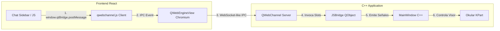

# Especificación de Requisitos (Spec): Spec 7 - Entorno de Integración Web

Este documento establece la definición formal de la **Spec 7: Entorno de Integración Web** según la metodología Spec Driven Development (SDD). Esta especificación detalla la integración del frontend web en React/TypeScript dentro del visor nativo C++ a través de `QWebEngineView`, estableciendo el canal de comunicación bidireccional IPC con `Qt WebChannel`.

---

## 1. Definición del Problema y Objetivos
Para dotar al lector de PDF de capacidades inteligentes (Chat de IA, Biblioteca con Tabla e Historial, y Grafo de Similitud Semántica), necesitamos una interfaz gráfica interactiva y moderna. Desarrollaremos esta UI usando React + TypeScript.

El objetivo de esta Spec es:
1. Crear el subproyecto React en `/frontend/` usando Vite.
2. Embeber esta interfaz web dentro de la ventana de C++ usando `QWebEngineView`.
3. Soportar una disposición híbrida:
   - **Pestaña 1 (Documento):** PDF Viewer nativo (Okular KPart) y panel lateral de React (Chat/Asistencia) lado a lado usando un divisor deslizable (`QSplitter`).
   - **Pestaña 2 (Biblioteca):** Interfaz full-screen de React (para visualización del Grafo y la Tabla de documentos).
4. Implementar el puente de comunicación IPC (`Qt WebChannel`) para el paso bidireccional de mensajes entre C++ y React.

---

## 2. Alcance (Límites del Sistema)

### Qué HACE la Spec (In-Scope)
* **Subproyecto React `/frontend/`:** Inicialización de una aplicación React 18+ con TypeScript y Vite.
* **Integración CMake para WebEngine/WebChannel:** Actualización de `/visor/CMakeLists.txt` para incluir las dependencias `Qt6WebEngineWidgets` y `Qt6WebChannel`.
* **Clase `JSBridge` en C++:** Creación de una clase puente derivada de `QObject` que se registrará con `QWebChannel`. Esta clase expondrá métodos y señales para la comunicación con JavaScript.
* **Diseño del Contenedor Híbrido (Pestañas + Splitter):**
  - Reemplazo del widget central de `MainWindow` con un `QTabWidget`.
  - **Pestaña 1 (Lector):** Contiene un `QSplitter` horizontal. A la izquierda se aloja el Okular KPart; a la derecha, un `QWebEngineView` cargando el chat lateral (URL `/chat`).
  - **Pestaña 2 (Biblioteca):** Contiene un `QWebEngineView` a pantalla completa cargando la biblioteca de documentos (URL `/library`).
* **Modo Dual de Carga (Desarrollo vs. Producción):**
  - *Desarrollo (Debug):* Carga de URLs locales vivas (ej: `http://localhost:5173/chat` y `http://localhost:5173/library`).
  - *Producción (Release):* Carga de archivos estáticos compilados y servidos localmente.
* **Puente de Pruebas Iniciales:**
  - Envío de un string desde el chat de React hacia C++ y su impresión en consola.
  - Envío de una señal desde C++ a React para notificar la carga de un archivo PDF.

### Qué NO HACE la Spec (Out-of-Scope)
* **No implementa el diseño real de las interfaces del Chat (Spec 8):** Solo se presentarán vistas HTML simples de prueba (mockups funcionales).
* **No implementa el diseño real de la Tabla o el Grafo Semántico (Spec 9):** Solo vistas web iniciales vacías para probar rutas.
* **No intercepta la selección del PDF ni envía atajos de teclado (Spec 10):** Toda la integración de atajos avanzados de selección en C++ pertenece a la Spec 10.

---

## 3. Arquitectura y Flujo de Datos

### Diagrama de la Interfaz Híbrida (Layout en MainWindow)
```text
+-------------------------------------------------------------------+
|  Lector PDF Inteligente (MainWindow KParts::MainWindow)          |
+-------------------------------------------------------------------+
| [ Pestaña 1: Documento ]  [ Pestaña 2: Biblioteca ]               |
| +------------------------------------+--------------------------+ |
| |                                    |                          | |
| |                                    |  QWebEngineView          | |
| |        Visor PDF (Okular KPart)    |  (Sidebar React Chat)    | |
| |                                    |                          | |
| |                                    |                          | |
| |                                    |                          | |
| +------------------------------------+--------------------------+ |
+-------------------------------------------------------------------+
```

### Arquitectura de Comunicación IPC (WebChannel Bridge)


---

## 4. Próxima Fase (Fase 2: Planificación Técnica)
Una vez aprobada esta especificación por el usuario:
1. Se realizará un **commit en git** con la definición aprobada.
2. Se iniciará la redacción del **Plan Técnico** detallando las librerías a agregar, la estructura de directorios del frontend y los cambios de interfaz.
