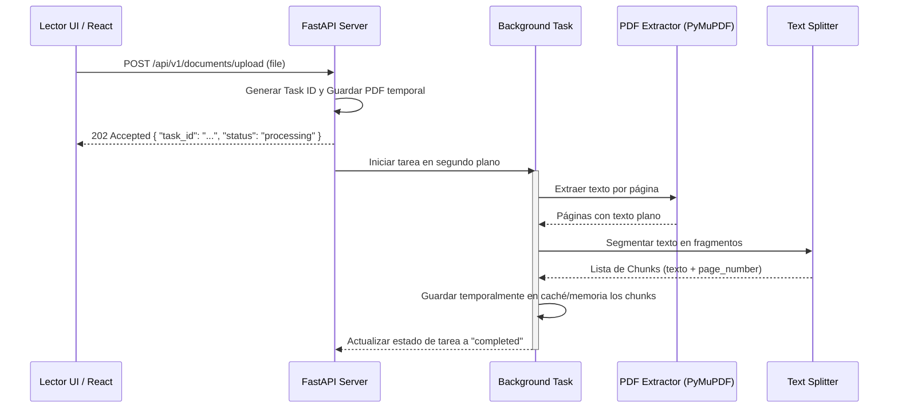

# Especificación de Requisitos (Spec): Spec 2 - Parsing & Chunking

Este documento establece la definición formal de la **Spec 2: Parsing & Chunking** según la metodología Spec Driven Development (SDD). Esta especificación define el alcance, límites, arquitectura y flujos para el motor de procesamiento de PDFs e ingesta de datos.

---

## 1. Definición del Problema y Objetivos
Para construir el sistema RAG (Retrieval-Augmented Generation), es indispensable extraer el texto de los documentos PDF y fragmentarlo en segmentos manejables y con sentido semántico (chunks). 

Esta especificación cubre la creación de los endpoints para recibir archivos PDF, procesarlos de forma asíncrona, aplicar un pipeline de extracción estructurada y segmentar el texto en fragmentos con metadatos de referencia (como número de página) indispensables para la posterior búsqueda vectorial e interactividad del chat.

---

## 2. Alcance (Límites del Sistema)

### Qué HACE la Spec (In-Scope)
* **API de Ingesta:** Creación del endpoint `POST /api/v1/documents/upload` que recibe un archivo PDF.
* **Procesamiento Asíncrono:** Uso de `BackgroundTasks` de FastAPI para desencadenar el pipeline de procesamiento en segundo plano de manera que el cliente reciba una respuesta rápida (`202 Accepted`).
* **Extracción de Texto Estructurado:** Uso de una librería especializada (ej. `PyMuPDF`) para extraer texto plano junto con información estructural básica (números de página).
* **Pipeline de Chunking:** Segmentación del texto usando una estrategia modular (como Recursive Character Splitter) basada en un tamaño máximo de fragmento y solapamiento.
* **Retorno de Estado:** Endpoints para consultar el estado del procesamiento (`GET /api/v1/documents/status/{task_id}`).

### Qué NO HACE la Spec (Out-of-Scope)
* **No guarda embeddings en la BD vectorial:** El guardado y persistencia en una base de datos vectorial (LanceDB/SQLite-vec) corresponde a la **Spec 3**.
* **No genera embeddings:** La llamada al modelo de embeddings o integraciones con Gemini corresponden a la **Spec 4**.
* **No implementa interfaz de usuario:** La UI para subir archivos se construirá en las specs de la Etapa 2 y 3.

---

## 3. Arquitectura y Flujo de Datos

### Flujo de Trabajo del Ingest Pipeline

---

## 4. Próxima Fase (Fase 2: Planificación Técnica)
Una vez completado el formulario de requisitos por parte del usuario:
1. Realizaremos la sesión de refinamiento de la Spec 2.
2. Tras la aprobación, se creará la rama de desarrollo `backend/parsing-chunking`.
3. Se redactará el Plan Técnico detallado de archivos e integración de las librerías elegidas.
