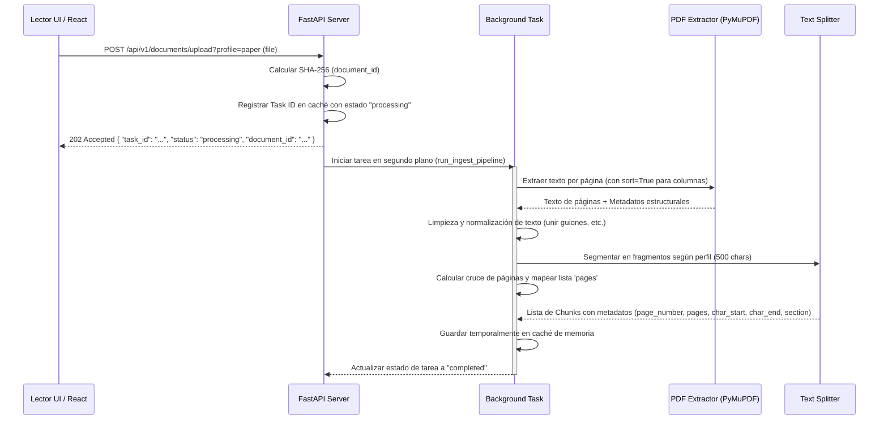

# Especificación de Requisitos (Spec): Spec 2 - Parsing & Chunking

Este documento establece la definición formal de la **Spec 2: Parsing & Chunking** según la metodología Spec Driven Development (SDD). Esta especificación define el alcance, límites, arquitectura y flujos para el motor de procesamiento de PDFs e ingesta de datos.

---

## 1. Definición del Problema y Objetivos
Para construir el sistema RAG (Retrieval-Augmented Generation), es indispensable extraer el texto de los documentos PDF y fragmentarlo en segmentos manejables y con sentido semántico (chunks). 

Esta especificación cubre la creación de los endpoints para recibir archivos PDF, procesarlos de forma asíncrona, aplicar un pipeline de extracción estructurada y segmentar el texto en fragmentos con metadatos de referencia (como número de página) indispensables para la posterior búsqueda vectorial e interactividad del chat.

---

## 2. Alcance (Límites del Sistema)

### Qué HACE la Spec (In-Scope)
* **API de Ingesta:** Creación del endpoint `POST /api/v1/documents/upload` que recibe un archivo PDF.
  * Permite configurar parámetros de segmentación a través de parámetros de consulta (`chunk_size`, `chunk_overlap`) o mediante perfiles de lectura predefinidos (`profile="paper"` o `profile="book"`).
* **Procesamiento Asíncrono:** Uso de `BackgroundTasks` de FastAPI para desencadenar el pipeline de procesamiento en segundo plano de manera que el cliente reciba una respuesta rápida (`202 Accepted`).
* **Extracción de Texto Estructurado con PyMuPDF (`fitz`):** Extrae el texto plano estructurado por páginas.
  * **Ordenamiento de Layout (`sort=True`):** Extrae el texto siguiendo el flujo de lectura real (columna izquierda antes que columna derecha), lo que evita mezclar texto normal con fórmulas en papers científicos de doble columna.
* **Manejo de Fórmulas Matemáticas y LaTeX:**
  * Las fórmulas matemáticas y ecuaciones que se compilan como texto en el PDF se extraen en formato Unicode estandarizado.
  * La limpieza de texto preservará caracteres especiales y símbolos matemáticos comunes (griegos, operadores).
  * Para asegurar que las fórmulas complejas no pierdan su sentido, los chunks mantendrán el texto explicativo circundante (scaffolding conceptual). De este modo, aunque una fórmula compleja se extraiga con ligeras imperfecciones de formateo, el LLM recibe el contexto del párrafo que explica dicha ecuación.
* **Limpieza de Texto Avanzada para Papers:**
  * Remoción de dobles espacios y normalización de saltos de línea.
  * Reconstrucción de palabras cortadas por guiones al final de línea (`word- \n wrap` -> `wordwrap`).
* **Segmentador Recursivo (Recursive Character Splitter):** Divide el texto priorizando saltos de párrafo (`\n\n`), saltos de línea (`\n`), puntos y espacios.
  * **Perfil "paper" (Por defecto):** fragmentos de ~500 caracteres con ~100 de solapamiento.
  * **Perfil "book":** fragmentos de ~1000 caracteres con ~200 de solapamiento.
  * **Personalizado:** el usuario podrá enviar explícitamente `chunk_size` y `chunk_overlap`.
* **Metadatos Extraídos por Chunk (Resolución de Cruce de Páginas):**
  * `document_id`: Hash único (SHA-256) del contenido del archivo PDF.
  * `page_number`: Página física donde **comienza** el fragmento (útil para la navegación y saltos al hacer clic en el visor).
  * `pages`: Lista de números de páginas (`List[int]`) que abarca el fragmento (ej. `[1, 2]` si un párrafo cruza el límite de página). Esto permite al visor indicar "Págs. 1-2" y resaltar la sección correcta.
  * `char_start` / `char_end`: Posiciones absolutas de caracteres dentro del texto extraído de esa página.
  * `section`: Identificación heurística de secciones (ej. "1. Introduction", "Abstract", "2. Methodology") mediante expresiones regulares sobre líneas en mayúsculas o numeradas al inicio de fragmentos.
* **API de Consulta de Estado:**
  * Endpoint `GET /api/v1/documents/status/{task_id}` para consultar el estado del procesamiento (`processing`, `completed`, `failed`).
  * Endpoint `GET /api/v1/documents/chunks/{document_id}` para recuperar temporalmente los chunks procesados.

### Qué NO HACE la Spec (Out-of-Scope)
* **No guarda embeddings en la BD vectorial:** El guardado y persistencia en una base de datos vectorial (LanceDB/SQLite-vec) corresponde a la **Spec 3**. En esta spec, el estado y los fragmentos se almacenan temporalmente en memoria (in-memory cache/dict).
* **No genera embeddings:** La llamada al modelo de embeddings o integraciones con Gemini corresponden a la **Spec 4**.
* **No implementa interfaz de usuario:** La UI para subir archivos se construirá en las specs de la Etapa 2 y 3.

---

## 3. Arquitectura y Flujo de Datos

### Flujo de Trabajo del Ingest Pipeline

---

## 4. Próxima Fase (Fase 2: Planificación Técnica)
Una vez aprobada esta especificación de viva voz por el usuario:
1. Se realizará un **commit en git** con la definición aprobada.
2. Se iniciará la redacción del **Plan Técnico** (archivos exactos a crear y modificar, dependencias de PyMuPDF, etc.).
