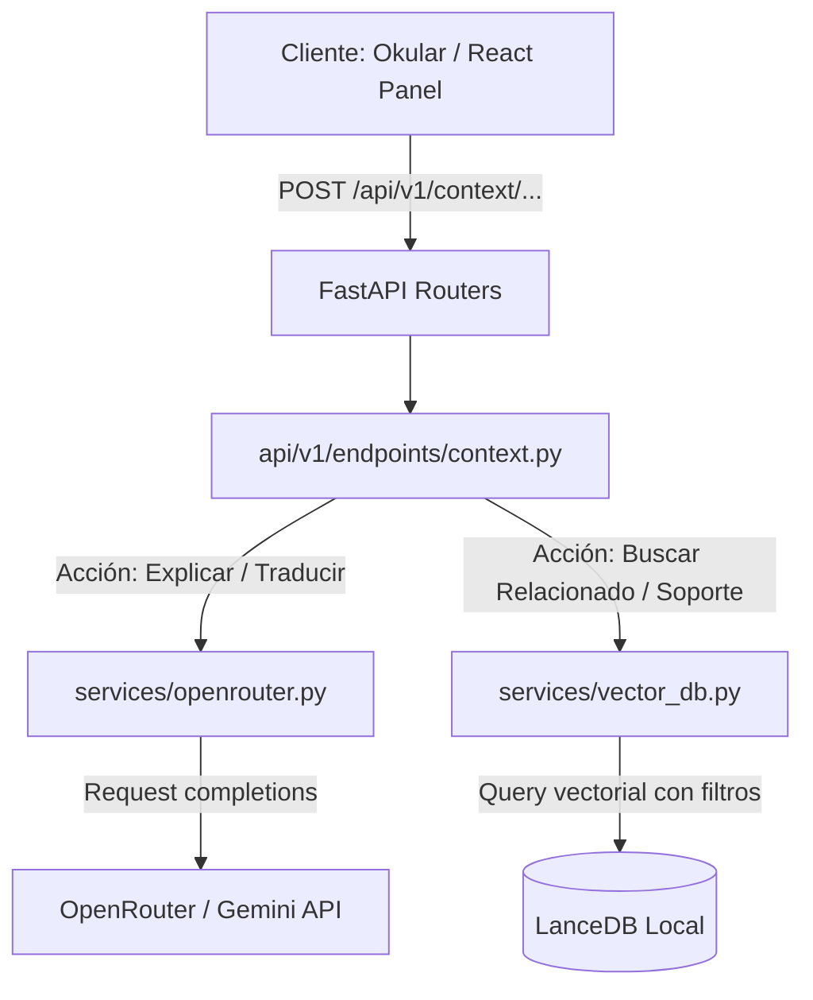
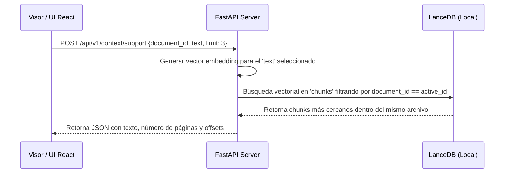

# Especificación de Requisitos (Spec): Spec 5 - Servicios de Acción Contextual

Este documento establece la definición formal de la **Spec 5: Servicios de Acción Contextual** según la metodología Spec Driven Development (SDD). Esta especificación define el alcance, límites, arquitectura y flujos de datos para los endpoints del backend que habilitan interacciones inteligentes y contextuales a partir de texto seleccionado por el usuario en el visor.

---

## 1. Definición del Problema y Objetivos
El visor de PDF e interfaz de chat permiten interactuar con el documento completo, pero a menudo los usuarios encuentran párrafos, términos técnicos, fórmulas o referencias complejas que requieren explicación o contexto inmediato sin necesidad de formular una pregunta manual en el chat lateral.

El objetivo de esta Spec es exponer un conjunto de servicios API en el backend FastAPI que resuelvan acciones contextuales rápidas sobre un texto seleccionado:
1. **Explicar:** Generar desgloses conceptuales rápidos y didácticos.
2. **Traducir:** Traducir manteniendo la coherencia técnica y contextual.
3. **Buscar Relacionado:** Encontrar pasajes similares en *otros* documentos de la biblioteca.
4. **Contexto / Soporte Interno:** Encontrar explicaciones complementarias o definiciones en el *mismo* documento para facilitar la lectura fluida.

---

## 2. Alcance (Límites del Sistema)

### Qué HACE la Spec (In-Scope)
* **Endpoints de Acción Contextual:**
  * `POST /api/v1/context/explain`: Retorna una explicación estructurada del texto seleccionado utilizando el LLM, apoyándose en fragmentos relevantes del documento.
  * `POST /api/v1/context/translate`: Retorna la traducción contextualizada del texto seleccionado al idioma configurado utilizando el LLM.
  * `POST /api/v1/context/search-related`: Realiza una búsqueda vectorial en LanceDB sobre fragmentos de **otros** documentos de la biblioteca para encontrar contenido afín.
  * `POST /api/v1/context/support`: Realiza una búsqueda vectorial en LanceDB sobre fragmentos del **mismo** documento para devolver pasajes que ayuden a entender la selección.
* **Integración con LLM (OpenRouter/Gemini):**
  * Diseño e inyección de prompts específicos para explicaciones didácticas (estilo micro-andamiaje) y traducción científica contextualizada.
  * Configuración del modelo para responder de forma rápida (optimizado para baja latencia).
* **Consultas Especializadas en LanceDB:**
  * Búsqueda vectorial filtrando por exclusión (`document_id != active_id`) para buscar relacionados.
  * Búsqueda vectorial filtrando por inclusión (`document_id == active_id`) para soporte interno.
* **Calidad de Código y Pruebas:**
  * Creación de pruebas unitarias y de integración para cada uno de los cuatro endpoints usando `pytest`.

### Qué NO HACE la Spec (Out-of-Scope)
* **No implementa interfaz gráfica (UI):** No crea los paneles de React, cuadros de diálogo flotantes, ni menús contextuales en el visor (corresponde a la **Spec 8** y **Spec 10**).
* **No implementa atajos de selección en C++:** Toda la captura de la selección en Okular y el envío de eventos a través de Qt WebChannel corresponde a la **Spec 10**.
* **No altera el historial conversacional del chat:** Estas son consultas efímeras puntuales y no se persisten en la tabla `chat_messages` a menos que el usuario decida explícitamente "enviar al chat" en fases futuras.

---

## 3. Arquitectura y Flujos de Datos

### Diagrama de Enrutamiento y Capas


### Flujo de Datos: Soporte Interno (Context Support)


---

## 4. Estructura de Endpoints Propuesta (Esquemas Pydantic)

### Modelos de Entrada común
```python
from pydantic import BaseModel, Field

class ContextActionRequest(BaseModel):
    document_id: str = Field(..., description="ID del documento activo")
    selected_text: str = Field(..., description="Texto seleccionado por el usuario en el visor")
    target_language: str | None = Field("es", description="Idioma destino (solo para traducción)")
    limit: int = Field(3, ge=1, le=10, description="Límite de resultados relacionados a retornar")
```

---

## 5. Próxima Fase (Fase 2: Planificación Técnica)
Una vez revisada y aprobada esta especificación por el usuario:
1. Se realizará el commit de esta Definición.
2. Se iniciará la creación del Plan Técnico detallado (Fase 2).
