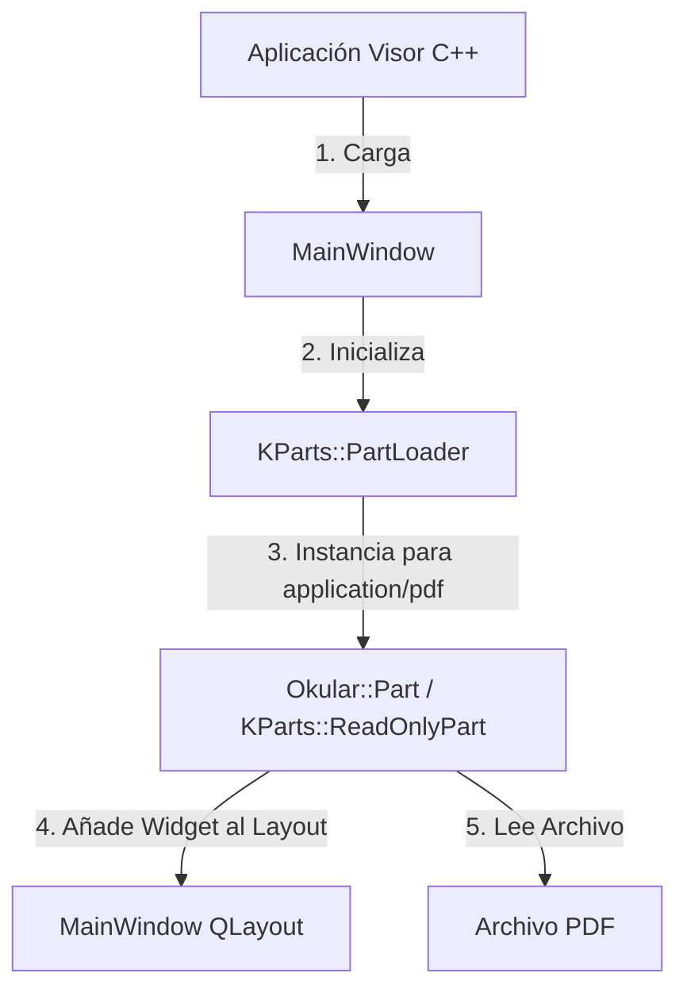

# Especificación de Requisitos (Spec): Spec 6 - Visor Base Okular

Este documento establece la definición formal de la **Spec 6: Visor Base Okular** según la metodología Spec Driven Development (SDD). Esta especificación define el alcance, límites, arquitectura y flujos para establecer la aplicación de escritorio nativa en C++ y Qt 6, enlazando la biblioteca del núcleo de Okular (`libokular6core`) e integrando el visor nativo.

---

## 1. Definición del Problema y Objetivos
Para construir un lector inteligente de PDFs, se requiere una interfaz nativa rápida y madura para visualizar los documentos. En lugar de crear un visor de PDF desde cero o usar alternativas web lentas, utilizaremos las capacidades nativas de **Okular (C++ / Qt 6)**.

El objetivo de esta Spec es crear la aplicación C++/Qt 6 base (ubicada en `/visor/`) que sirva de contenedor principal, configure el entorno de compilación con CMake en Fedora, instale las dependencias de desarrollo necesarias y levante una ventana con el visor de PDF integrado usando la biblioteca/KPart oficial de Okular.

---

## 2. Alcance (Límites del Sistema)

### Qué HACE la Spec (In-Scope)
* **Gestión de Dependencias (Fedora):** Documentación e instrucciones precisas utilizando `dnf` para instalar las dependencias de desarrollo de Qt 6, KDE Frameworks 6 (KF6) y Okular 6 (ej. `okular-devel`, `kf6-kparts-devel`, `qt6-qtbase-devel`).
* **Configuración del Sistema de Construcción (CMake):** Archivo `CMakeLists.txt` configurado para buscar paquetes de Qt 6, KF6 (KParts, KXmlGui, KI18n) y Okular 6 (`Okular6`).
* **Estructura C++ Estándar:** Creación del directorio `/visor/` y archivos fuente iniciales (`main.cpp`, `mainwindow.cpp`, `mainwindow.h`).
* **Ventana Principal (MainWindow):** Ventana basada en Qt 6 (`QMainWindow` o `KXmlGuiWindow`) que actúa como contenedor.
* **Integración del Visor Nativo (Okular KPart):** Carga dinámica de la biblioteca/KPart de Okular mediante la API de plugins de KDE KF6 (`KParts::PartLoader`), incrustándola en la interfaz.
* **Carga de Documentos:** Capacidad de abrir un archivo PDF suministrado por argumento de línea de comandos al ejecutar la aplicación.
* **Controles Básicos:** Presentar la interfaz nativa del visor de Okular con su barra de herramientas, miniaturas y modo de selección de texto.

### Qué NO HACE la Spec (Out-of-Scope)
* **No integra QWebEngineView ni React:** El panel lateral web y la configuración de Chromium embebido se realizarán en la **Spec 7**.
* **No implementa comunicación IPC:** El puente `QtWebChannel` para sincronización bidireccional entre C++ y JavaScript se desarrollará en la **Spec 7**.
* **No realiza llamadas a la API de FastAPI/IA:** Las acciones contextuales avanzadas (Traducir, Explicar, Buscar) pertenecen a la integración en la **Spec 8** y **Spec 10**.
* **No expone los atajos de teclado de selección:** La captura de texto y envío de eventos avanzados a través de atajos personalizados se implementará en la **Spec 10**.

---

## 3. Arquitectura y Flujo de Datos

### Estructura del Visor C++ en el Workspace
El visor se ubicará en la raíz en la carpeta `/visor/`:
```text
visor/
├── CMakeLists.txt          # Configuración del build (Qt 6 + KF6 + Okular6)
├── src/
│   ├── main.cpp            # Inicialización de la aplicación y KAboutData
│   ├── mainwindow.cpp      # Ventana principal e integración del KPart
│   └── mainwindow.h        # Definición de la clase MainWindow
└── README.md               # Instrucciones de compilación y prerrequisitos en Fedora
```

### Diagrama de la Arquitectura del Visor Base


### Flujo de Datos: Arranque y Carga de PDF
1. El usuario ejecuta: `./visor /ruta/al/documento.pdf`.
2. `main.cpp` lee la ruta del PDF, inicializa la aplicación Qt y los metadatos de KDE (`KAboutData`).
3. Se instancia `MainWindow`, que crea el layout principal.
4. `MainWindow` invoca a `KParts::PartLoader::instantiatePartForMimeType` solicitando el componente para `application/pdf`.
5. Si el sistema tiene instalado `okular-part` (KPart de Okular), el cargador devuelve una instancia de `KParts::ReadOnlyPart`.
6. `MainWindow` toma el widget del KPart (`part->widget()`) y lo inserta en su layout central.
7. Se llama a `part->openUrl(QUrl::fromLocalFile(pdfPath))` para renderizar el documento PDF en pantalla.

---

## 4. Próxima Fase (Fase 2: Planificación Técnica)
Una vez aprobada esta especificación por el usuario:
1. Se realizará un **commit en git** con la definición aprobada.
2. Se iniciará la redacción del **Plan Técnico** (archivos exactos, dependencias de desarrollo de Fedora detalladas, y estructura base del código).
